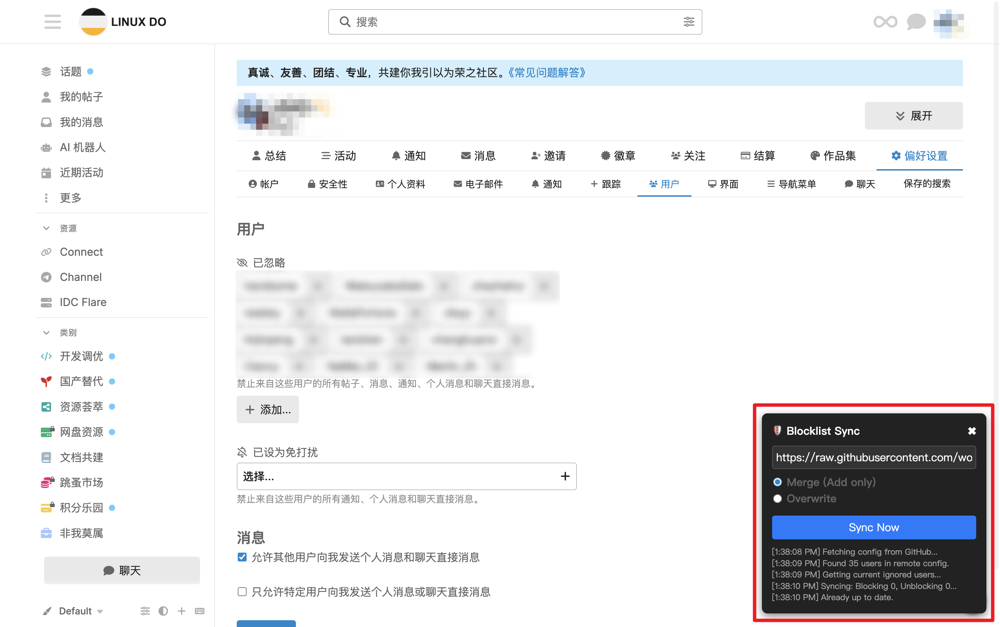

# Linux DO Script Lite

Linux DO 论坛助手脚本 (Chrome Extension)。  
主要功能是帮助用户同步和管理屏蔽列表 (Blocklist)，支持从远程配置自动同步忽略用户。

> ⚠️ **免责声明**
> 
> 1. **非官方项目**: 本项目由第三方开发者维护，与 Linux DO 论坛官方无关。
> 2. **个人选择**: 屏蔽功能仅为辅助用户管理个人浏览体验的工具，属于用户个人行为。
> 3. **中立性**: 屏蔽列表的使用不代表对被屏蔽用户的任何评价，亦非用于引战或制造对立。请理性使用。

## 💡 开发目的

本项目命名为 **Lite**，旨在保持最**精简**的代码和功能。  
摒弃非必要的功能堆砌，以确保脚本的轻量化、安全性及易维护性。

## 运行效果

  

## 主要功能

- **🛡️ 屏蔽列表同步**: 从指定的远程 URL (如 GitHub Raw) 拉取屏蔽列表配置。
- **🔄 双向同步模式**:
  - **Merge (合并模式)**: 仅添加远程列表中新增的用户，保留本地已屏蔽的用户。
  - **Overwrite (覆盖模式)**: 强制与远程列表保持一致 (会取消屏蔽不在远程列表中的用户)。
- **UI 配置界面**: 页面右下角悬浮窗，方便随时调整配置和手动触发同步。
- **Discourse API 集成**: 直接调用论坛接口，无需手动刷新页面即可生效。

## 安装指南

1. 下载本项目代码到本地。
2. 打开 Chrome/Edge 浏览器，进入扩展程序管理页面 (`chrome://extensions/`)。
3. 开启右上角的 **开发者模式 (Developer mode)**。
4. 点击 **加载已解压的扩展程序 (Load unpacked)**。
5. 选择本项目文件夹即可。

## 使用说明

1. 扩展加载成功后，刷新 Linux DO 论坛页面。
2. 页面右下角会出现一个 **🛡️ 盾牌图标**。
3. 点击图标打开设置面板：
   - **Config URL**: 输入包含用户名的文本文件 URL (每行一个用户名，支持 `#` 注释)。
     - 默认示例: `https://raw.githubusercontent.com/wowhao333/linuxdo-config/refs/heads/main/user-blocklist.conf`
   - **Sync Mode**: 选择同步模式 (Merge 或 Overwrite)。
     > ⚠️ **警告**: 当前请勿使用 **Overwrite** 模式。该功能尚未完全验证，可能导致意外取消屏蔽现有用户。
   - **Sync Now**: 点击按钮开始同步。
4. 下方的日志区域会显示同步进度和结果。

## 项目结构

本项目采用 Chrome Extension Manifest V3 架构，利用 Isolated World 和 Main World 的特性实现安全且强大的功能。

- `manifest.json`: 扩展配置文件。
- `src/isolated.js`: **隔离环境脚本**。
  - 负责渲染 UI 界面。
  - 管理配置存储 (`chrome.storage`)。
  - 处理远程配置的 Fetch 请求 (通过 Background 转发以跨域)。
  - 计算差异 (Diff) 并指挥 Main World 执行操作。
- `src/main_world.js`: **主环境脚本**。
  - 注入到页面上下文中运行。
  - 获取 CSRF Token 和当前用户信息。
  - 封装 Discourse API (`setIgnoreUser`) 执行实际的屏蔽/取消屏蔽操作。
- `src/background.js`: **后台服务 Worker**。
  - 代理网络请求，解决 CORS 跨域问题。

## 贡献

欢迎提交 PR 或 Issue 改进本项目。

## License

MIT
